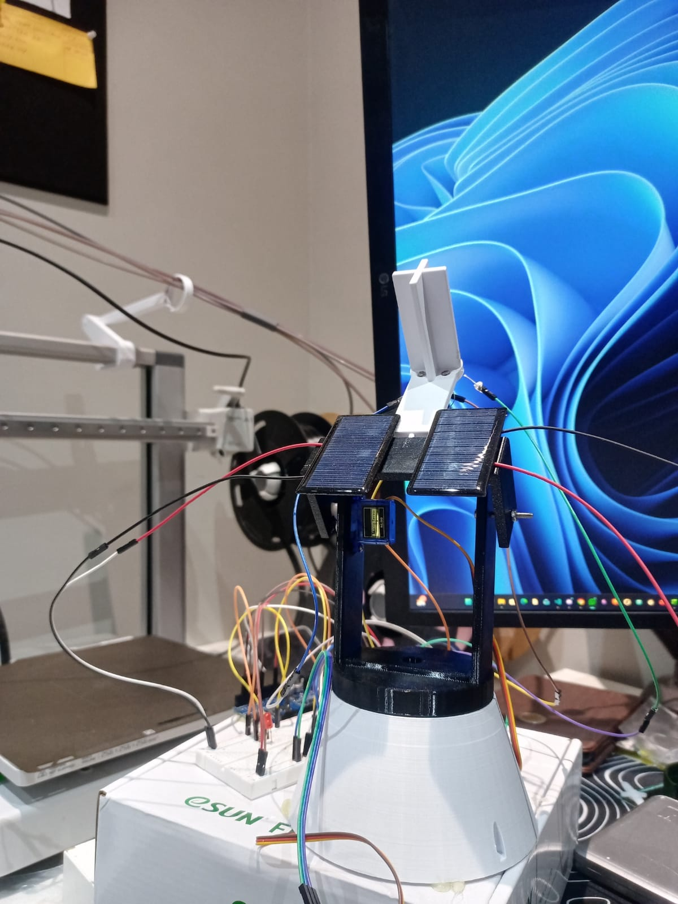

# Dual-Axis Solar Tracker using Arduino

A smart solar tracking system that automatically orients a solar panel towards the brightest light source (the sun) to maximize energy efficiency. This project uses 4 LDRs (Light Dependent Resistors) to detect light intensity and 2 Servo motors to move the panel horizontally and vertically.



## 🚀 Features
* **Dual-Axis Tracking:** Follows the sun's path from East to West and adjusts its tilt (elevation) for seasonal changes.
* **Signal Smoothing:** Uses an averaging algorithm to prevent servo jitter caused by sensor noise.
* **Night Mode:** Automatically detects darkness and resets the tracker to the "Sunrise" (East) position, ready for the next morning.
* **Adjustable Sensitivity:** Code includes variables to tune tolerance and speed.

## 🖨️ 3D Printed Parts
The mechanism requires 4 custom-designed parts to assemble the Pan/Tilt structure.

| File Name | Description |
| :--- | :--- |
| **BOTTOM SECTION.stl** | The stationary base that houses the bottom (Horizontal) servo. Secure this to a heavy surface or tripod. |
| **MIDDLE SECTION 8.stl** | The "shoulder" joint. It attaches to the horizontal servo horn and holds the vertical (Tilt) servo. |
| **ARM6.stl** | The moving arm attached to the vertical servo. This supports the main solar panel. |
| **LDR MOUNT.stl** | A specialized holder for the 4 LDR sensors. It includes the "+" shaped divider to cast shadows for directional tracking. |

### ⚙️ Print Settings
* **Material:** **PETG or ABS** is highly recommended if you plan to use this outdoors (PLA may warp in direct sunlight/heat).
* **Infill:** 20% - 30% (Standard grid or cubic) for rigidity.
* **Supports:** Required for `MIDDLE SECTION 8.stl` and `ARM6.stl`.
* **Layer Height:** 0.2mm for a good balance of strength and speed.

## 🛠️ Electronics Required
* **Microcontroller:** Arduino Uno (or compatible).
* **Motors:** 2x Servo Motors (SG90, MG90S, or MG996R).
* **Sensors:** 4x LDRs (Light Dependent Resistors).
* **Resistors:** 4x 10kΩ Resistors (for voltage dividers).
* **Power:** External 5V power supply (recommended for servos) or USB.

## 🔌 Wiring Diagram

### Servo Motors
| Servo | Wire Color | Arduino Pin |
| :--- | :--- | :--- |
| **Horizontal (Base)** | Orange/Signal | **D2** |
| | Red (VCC) | 5V |
| | Brown (GND) | GND |
| **Vertical (Tilt)** | Orange/Signal | **D13** |
| | Red (VCC) | 5V |
| | Brown (GND) | GND |

### LDR Sensors
*Note: Connect one leg of the LDR to 5V, and the other leg to the Analog Pin AND to GND via a 10kΩ resistor.*

| LDR Position | Arduino Pin |
| :--- | :--- |
| **Top Left** | **A0** |
| **Top Right** | **A3** |
| **Bottom Left** | **A1** |
| **Bottom Right** | **A2** |

## ⚙️ Configuration
You can adjust the following variables at the top of `solar_tracker.ino` to fit your specific build:

```cpp
int tol = 50;         // Sensitivity tolerance (lower = more sensitive)
int dtime = 20;       // Delay time (speed of loop)
int nightThresh = 50; // Darkness threshold for Night Mode (0-1023)

// Servo Limits (Adjust based on your 3D print physical limits)
int servohoriLimitHigh = 175;
int servohoriLimitLow = 5;
int servovertLimitHigh = 175;
int servovertLimitLow = 5;
